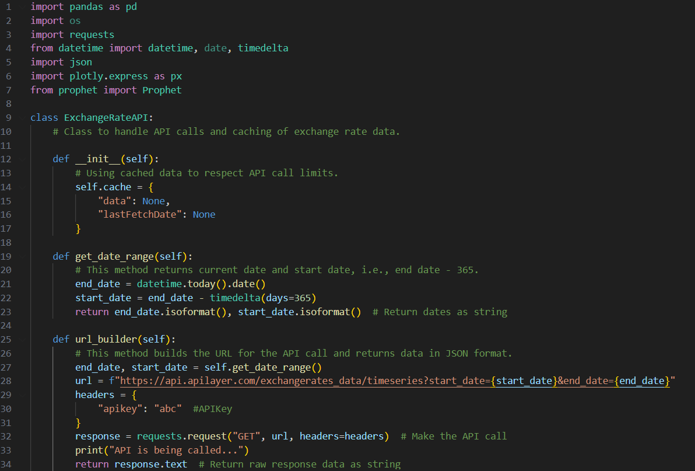
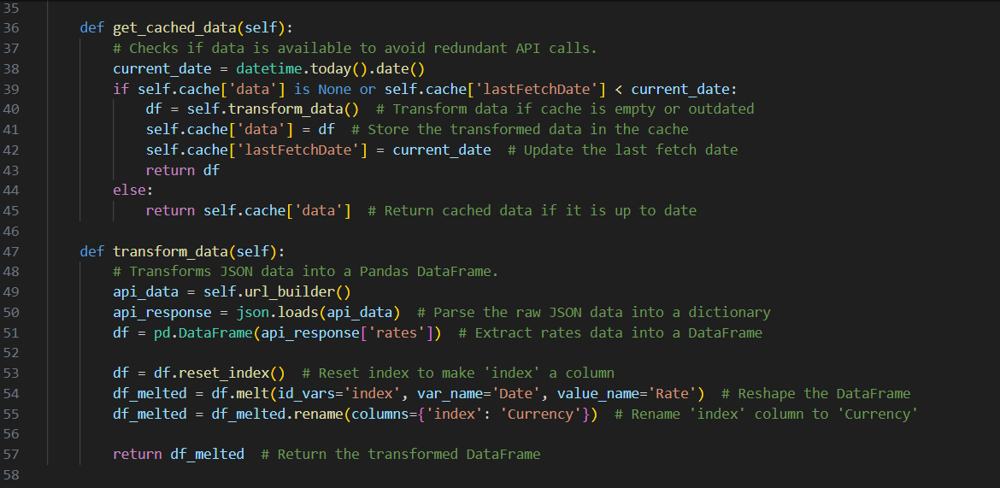
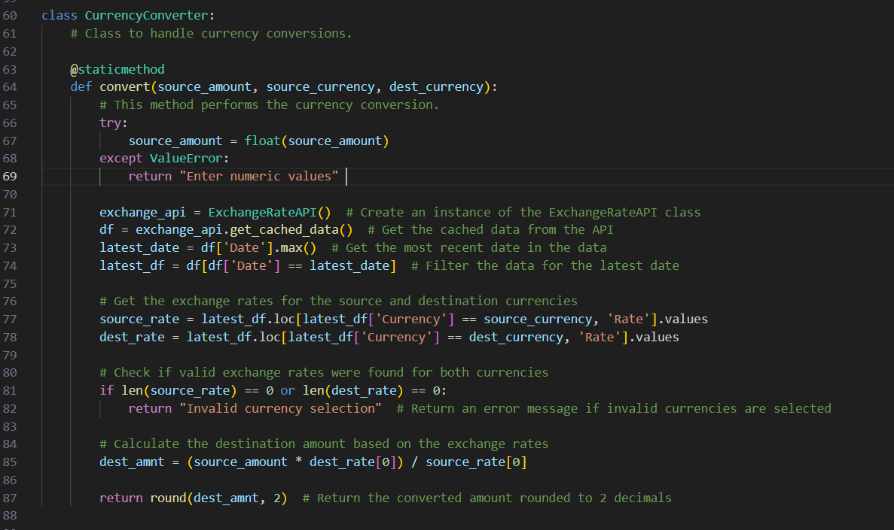
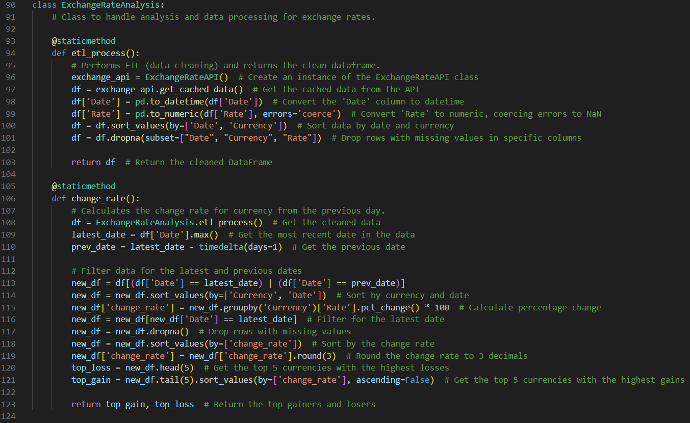
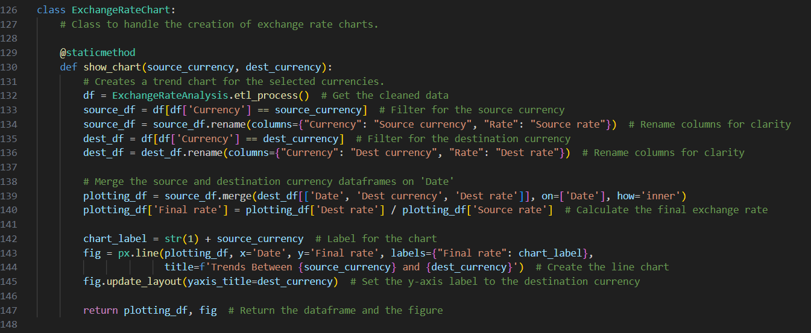
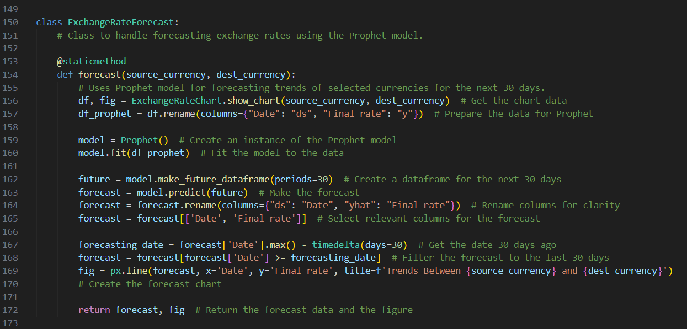
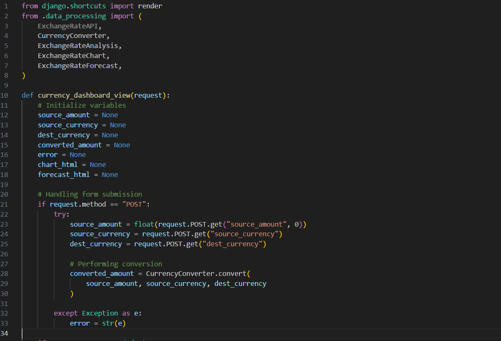
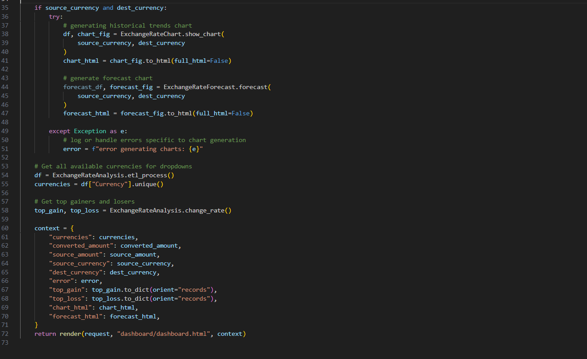
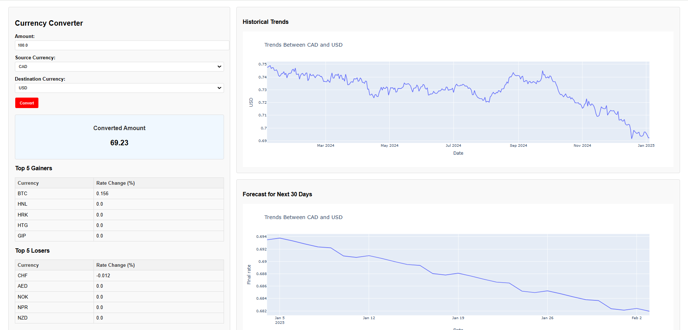

# Live Currency Converter Dashboard

This project focuses on the development of a **Currency Converter Dashboard** utilizing a live API and the **Django framework** to create an intuitive and user-friendly dashboard. The application is hosted on a **virtual machine**, ensuring global accessibility 24/7.

## Project Overview

The primary goal of this project was to design a dynamic and interactive platform where users can:

- View **real-time currency conversions**.
- Analyze **historical trends** of currency conversion over the past 365 days.
- Access **forecasted conversion trends** for the next 30 days.

The website is designed with ease of use in mind, providing users with both current and historical data, alongside future predictions, all in one centralized dashboard.

## Tools and Technologies Used

### Programming Language:
- **Python**: The core programming language used for building the application.

### Libraries:
- **requests**: Used for making HTTP requests to interact with APIs and retrieve data from the web.
- **Pandas**: Utilized for converting data into data frames and performing data cleaning and processing tasks.
- **Plotly & Matplotlib**: Libraries for creating interactive and static visualizations.
- **Datetime & date**: Used for handling and manipulating dates and times.
- **Prophet**: A forecasting tool used for predicting currency conversion rates for the next 30 days.

### Framework:
- **Django**: The framework used for designing the web application. The goal of the project was to build a currency converter, which is hosted on a virtual machine.

### API:
- **Exchange Rates API**: The application integrates with [APILayer Exchange Rates API](https://apilayer.com/) to fetch real-time exchange rates.

### Cloud Technology:
- **Oracle Ubuntu Compute Instance**: The application is hosted on an Oracle Cloud virtual machine (VM) running Ubuntu. The Ubuntu machine was set up and configured to ensure secure access to the application.
- **Security Ports Configuration**: The VM's security ports were configured to allow access to specific ports required by the application, ensuring that the necessary services were exposed to the internet while maintaining the security of the system.
- **Gitbash**: Used to interact with the virtual machine.
- **Putty**: Used to set up and manage the virtual machine on Oracle Cloud.

### Website Design:
- **HTML & CSS**: Used for designing and styling the front-end of the website.

### Version Control:
- **Git**: Used for version control to commit and pull code to and from the virtual machine.

### Integrated Development Environment (IDE):
- **Visual Studio**: The primary IDE used for development.

### Operating Systems:
- **Windows**: For local development and testing.
- **Linux (Ubuntu)**: For hosting the application on the virtual machine.

### Additional Setup:
- **Registering Port with Domain Name & SSL Certificate**: Configured domain name and secured the application with an SSL certificate for secure communication.

## Project Execution

### 1. Finding an API for Exchange Rates
The first step in executing this project was identifying a reliable API to fetch real-time exchange rate data. After evaluating various options, the **Exchange Rates API** provided by [APILayer](https://apilayer.com/) was chosen due to its extensive currency support and reliable data accuracy.

### 2. Selecting a Framework for Dashboard Creation
The next step involved selecting an appropriate framework to build the dashboard. **Django** was chosen as the framework for this project. The primary reason for using Django was to design a web-based dashboard that could be deployed and run directly on a server, particularly on the cloud-based virtual machine (VM).

Other tools like **Tableau** or **Power BI** were considered for dashboard creation. However, these platforms typically require additional costs for hosting interactive dashboards on the cloud and do not provide cost-effective solutions for running dashboards directly on cloud-based virtual machines without incurring ongoing charges for hosting and access. In contrast, **Django** allowed for a fully functional, interactive web application that could be hosted on a cloud server (such as an Oracle VM) at a fraction of the cost, ensuring global accessibility without the extra overhead of recurring charges associated with third-party dashboard platforms.

### 3. Code
The code is written following Object-Oriented Programming (OOP) principles, with distinct classes such as **ExchangeRateAPI**, **CurrencyConverter**, and **ExchangeRateChart** that encapsulate specific functionalities and interact through methods, ensuring modularity, reusability, and maintainability of the code.

The following code snippet demonstrates the functionality of the **ExchangeRateAPI** class, which handles API calls and caching of exchange rate data. It builds a URL for fetching historical exchange rates for the past 365 days and uses the **requests** library to make the API call. The code ensures that the API is only called when necessary, adhering to rate limits by utilizing cached data. This class also includes methods to define the date range for the API request and format the data for retrieval.

The following code snippet showcases the functionality for caching exchange rate data and transforming the raw JSON response into a structured format. The **`get_cached_data`** method ensures that redundant API calls are avoided by checking if the data is up-to-date. If the data is outdated or missing, it fetches and transforms new data. The **`transform_data`** method processes the raw API response into a Pandas DataFrame, reshaping and renaming columns for easier analysis.

The following code snippet represents the **CurrencyConverter** class, which handles currency conversions. The **`convert`** method takes the source amount and currencies (source and destination) as input, validates the data, and performs the conversion using the latest exchange rates from the **ExchangeRateAPI** class. It retrieves the most recent exchange rates, checks for valid selections, and computes the converted amount by applying the appropriate rates. The result is returned rounded to two decimal places.

The following code snippet demonstrates the functionality of the **ExchangeRateAnalysis** class, which handles the analysis and processing of exchange rate data. The **`ETL_process`** method performs data cleaning (ETL), including converting date columns to datetime, handling numeric errors, and removing rows with missing data. The **`change_rate`** method calculates the percentage change in exchange rates from the previous day for each currency. It processes the cleaned data, calculates the rate changes, and identifies the top-performing currencies with the highest change rates.

The following code snippet showcases the **ExchangeRateChart** class, which is responsible for creating exchange rate trend charts for selected currencies. The **`show_chart`** method filters and processes the data for the source and destination currencies, merges them on the "Date" column, and calculates the final exchange rate for plotting. The method uses **Plotly** to generate a line chart displaying the exchange rate trends for both currencies, with the chart's layout dynamically updated to reflect the selected destination currency.

The following code snippet demonstrates the **ExchangeRateForecast** class, which uses the **Prophet** model for forecasting the exchange rate trends of selected currencies over the next 30 days. The **`forecast`** method takes the source and destination currencies, prepares the data, and fits the Prophet model. It then generates a forecast for the next 30 days and visualizes the trends using **Plotly**. The output includes both the forecasted data and a line chart showing the predicted exchange rate trends.

All the methods from the classes are called in the **views.py** file, where the values are processed and stored in a dictionary. This dictionary is then passed to the HTML templates, rendering dynamic content on the website. The integration between the backend logic and frontend display is achieved by leveraging Django's templating system, ensuring a seamless user experience.

The final outcome of this project is a fully interactive currency converter dashboard that allows users to view historical trends and forecast future exchange rates. Below is a snippet of the dashboard, demonstrating the user interface and key features of the application.

